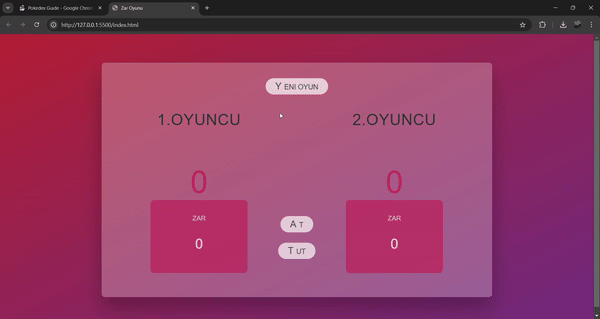

<h1> Zar Oyunu </h1>

 Kullanıcının attıgı zar ve onu kayıtta tutan ve sonrasında karşı tarafın attıgı zar aynı şekilde hafızasında tutan ve böylelikle aralarında skor oluşacak şekilde oyun halinde eğlenceli hale getirmiş olduk.

<h3>Kullanılan Yapılar</h3>

Html,Css ile yapıyı şekillendirdik.Javascript 
ile dinamik hale getirerek oyun haline keyifli hale getiridk.

<h3>Ekran Gif </h3>

